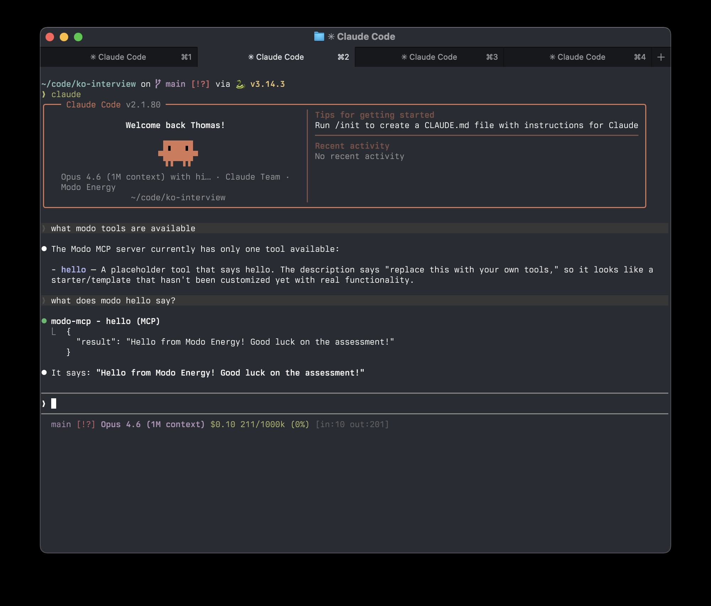

# Modo Energy — Ko (AI Analyst) Take-Home

## Overview

Your task is to build an MCP (Model Context Protocol) server that wraps the **Modo Energy public API**, allowing an LLM to query battery energy storage data through natural conversation.

Your server should expose 2–4 tools and be installable into Claude Code (or a similar MCP client).

Please spend **no more than 2 hours** on this task.

You are encouraged to use AI coding tools (Claude Code, Cursor, Copilot, etc). Please include a short note in your README stating which AI tools and models you had available.

## Background: Modo Indices

Modo Energy tracks the performance of battery energy storage systems (BESS) across multiple markets. A **Modo Index** represents a benchmark portfolio of battery assets in a given region. Think of it like a stock market index, but for batteries.

Each index tracks:
- **Revenue** — how much money the batteries in the index earned, broken down by market (e.g. wholesale trading, balancing mechanism, capacity market, ancillary services)
- **Capacity** — the total MW (power) and MWh (energy) of assets in the index over time

Indices exist for multiple regions: **GB**, **ERCOT** (Texas), **NEM** (Australia), and **CAISO** (California).

Revenue can be normalised (per MW or per MWh) and expressed over different time bases (per hour, per year) to allow fair comparison across assets of different sizes and across different time periods.

## The API

- **Getting started:** https://developers.modoenergy.com/docs/getting-started
- **Indices API reference:** https://developers.modoenergy.com/reference/index-list

Base URL: `https://api.modoenergy.com/pub/v1`

The following **Indices** endpoints are free to use, i.e. no API key or authentication required:

| Endpoint | Description |
|----------|-------------|
| `GET /indices/` | List all available indices. Filter by `market_region` (gb, ercot, nem, caiso) and `is_custom` (true/false). |
| `GET /indices/{id}/` | Get details of a single index, including its definition (asset filters, region, etc). |
| `GET /indices/{id}/revenue/` | Aggregated revenue for an index over a date range. Supports `capacity_normalisation` (mw, mwh), `time_basis` (hour, year), `breakdown` (market), and `markets` filtering. |
| `GET /indices/{id}/revenue/timeseries/` | Revenue as a time series. Adds `granularity` (base, daily, weekly, monthly). Cursor-paginated. |
| `GET /indices/{id}/capacity/timeseries/` | MW and MWh capacity over time. Filter by `date_from` / `date_to`. Cursor-paginated. |

## Tech stack

You are free to use whatever technology you like, but this project is set up with:

- **[uv](https://docs.astral.sh/uv/)** — Python package and project manager
- **[FastMCP](https://gofastmcp.com) v3** — framework for building MCP servers in Python

A skeleton `server.py` and `pyproject.toml` are provided as a starting point. You may restructure the project however you like.

## Getting started

### Install uv

```bash
# macOS / Linux
curl -LsSf https://astral.sh/uv/install.sh | sh

# or with Homebrew
brew install uv
```

### Set up the project

First, [fork this repository](https://github.com/thomas-leger-modo/ko-interview/fork) to your own GitHub account. Then:

```bash
# Clone your fork
git clone https://github.com/<your-github-username>/ko-interview.git
cd ko-interview

# Create a virtual environment and install dependencies
uv sync

# Run the server directly (stdio transport, for testing)
uv run server.py
```

### Common uv commands

```bash
uv sync                  # Install/update all dependencies from pyproject.toml
uv add <package>         # Add a new dependency
uv remove <package>      # Remove a dependency
uv run <command>         # Run a command in the project's virtual environment
uv run python server.py  # Run the server
```

### Install into an MCP client

**Claude Code:**

```bash
claude mcp add modo-mcp -- uv run server.py
```

**Cursor:** Add to your `.cursor/mcp.json`:

```json
{
  "mcpServers": {
    "modo-mcp": {
      "command": "uv",
      "args": ["run", "server.py"],
      "cwd": "/path/to/ko-interview"
    }
  }
}
```

Then start your MCP client and verify the hello world tool works.



## What to build

Use the skeleton in `server.py` as a starting point. A hello world tool is provided to verify your setup works — replace it with your own tools.

Your MCP server should expose **2–4 tools** that let an LLM meaningfully interact with the Modo Indices API. There is no single correct answer — use your judgement about which tools to build and how to design them.

A user should be able to ask questions like:

- *"Which Index performed the best in 2025?"*
- *"How has battery capacity grown in ERCOT over the past year?"*
- *"Compare monthly revenues in Q1 2025."*

Treat this like a real project. No need for deployment or CI configuration.

## Evaluation criteria

Your submission will be assessed on:

1. **Tool design**
2. **Usefulness**
3. **Code quality**

## Submission

1. [Fork this repository](https://github.com/thomas-leger-modo/ko-interview/fork) to your own GitHub account
2. Clone your fork and build your solution
3. Push your work to your fork
4. Send us the link to your GitHub repository
